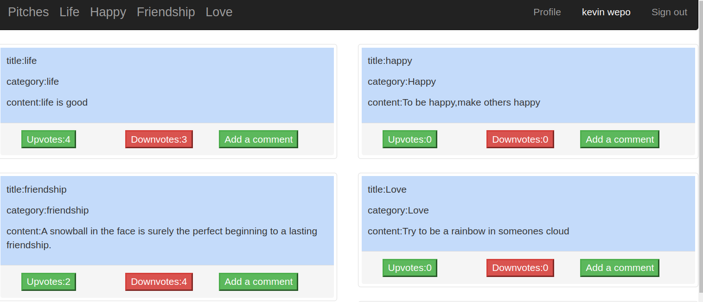
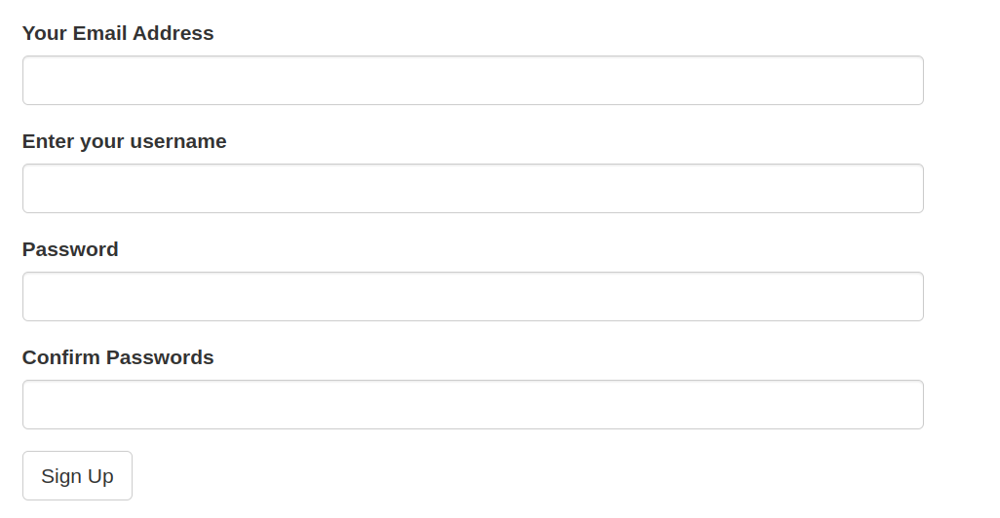
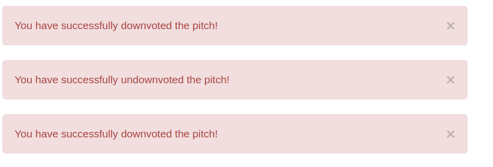
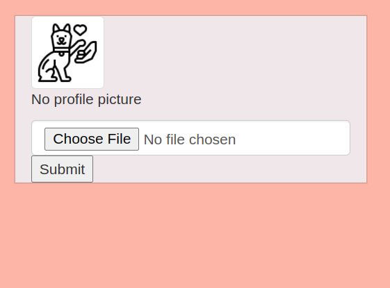

## Pitches

### 13 th may. 2022

## Author
 **Nancy Mwende**

# Description
This is a flask application that allows users to post one-minute pitches and also allows other users who have signed up to comment and upvote or downvote a pitch. It also allows a person to signup to be able to access the functionalities of the application.

## Live Link

## Screenshots

## Screenshot 1

## Screenshot 2

## Screenshot 3

## Screenshot 4

## User Story
  A user can;
* Register to be allowed to log in to the application
* Comment on different pitches posted by other users.
* View the pitches posted by other users.
* Vote on some or all pitches they have viewed by giving it a upvote or a downvote.
* View pitches of different categories.
* Submit a pitch to a specific category of their choice.

## BDD
| Behaviour | Input | Output |
| :---------------- | :---------------: | ------------------: |
| Load the page | *On page load* | Get all posts, Select between signup and login on the right side|
| Select SignUp| *Email,Username,Password* | Redirect to login|
| Select Login | *Username* and *password* | Redirect to page with app pitches based on categories and commenting section|
| Select comment button | *Comment* | Form that you input your comment|
| Click on submit |  | Redirect to all comments tamplate with your comment and other comments|

## Development Installation
To get the code..

1. Cloning the repository:
  bash
  https://github.com/nancymwende/pitches
  
2. cd to the folder pitches and install requirements
  bash
  cd pitches
  pip install -r requirements.txt
  
3. Exporting Configurations
  bash
  export SQLALCHEMY_DATABASE_URI=postgresql+psycopg2://{User Name}:{password}@localhost/{database name}
  
4. Running the application
  bash
  ./start.sh
  
5. Testing the application
  bash
  python3.8 manage.py test
  
Open the application on your browser `http://127.0.0.1:5000/`.

## Technology used

* Python3.8
* Flask
* Bootstrap
* Html
* Css

## Known Bugs
* There are no bugs yet.

## Support and contact details
For more information,comments or clarification contact on nancy.mwende@student.moringaschool.com

### License

MIT License

    Copyright (c) 2022 Nancy Mwende
    
    Permission is hereby granted, free of charge, to any person obtaining a copy
    of this software and associated documentation files (the "Software"), to deal
    in the Software without restriction, including without limitation the rights
    to use, copy, modify, merge, publish, distribute, sublicense, and/or sell
    copies of the Software, and to permit persons to whom the Software is
    furnished to do so, subject to the following conditions:
    
    The above copyright notice and this permission notice shall be included in all
    copies or substantial portions of the Software.
    
    THE SOFTWARE IS PROVIDED "AS IS", WITHOUT WARRANTY OF ANY KIND, EXPRESS OR
    IMPLIED, INCLUDING BUT NOT LIMITED TO THE WARRANTIES OF MERCHANTABILITY,
    FITNESS FOR A PARTICULAR PURPOSE AND NONINFRINGEMENT. IN NO EVENT SHALL THE
    AUTHORS OR COPYRIGHT HOLDERS BE LIABLE FOR ANY CLAIM, DAMAGES OR OTHER
    LIABILITY, WHETHER IN AN ACTION OF CONTRACT, TORT OR OTHERWISE, ARISING FROM,
    OUT OF OR IN CONNECTION WITH THE SOFTWARE OR THE USE OR OTHER DEALINGS IN THE
    SOFTWARE.